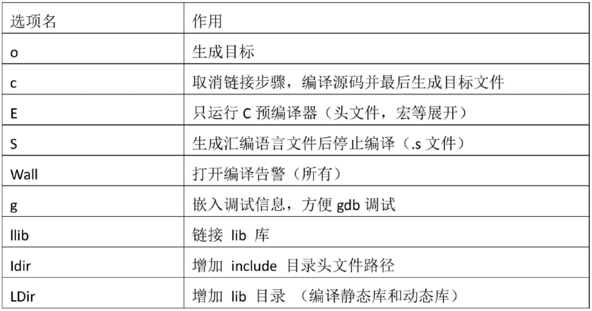
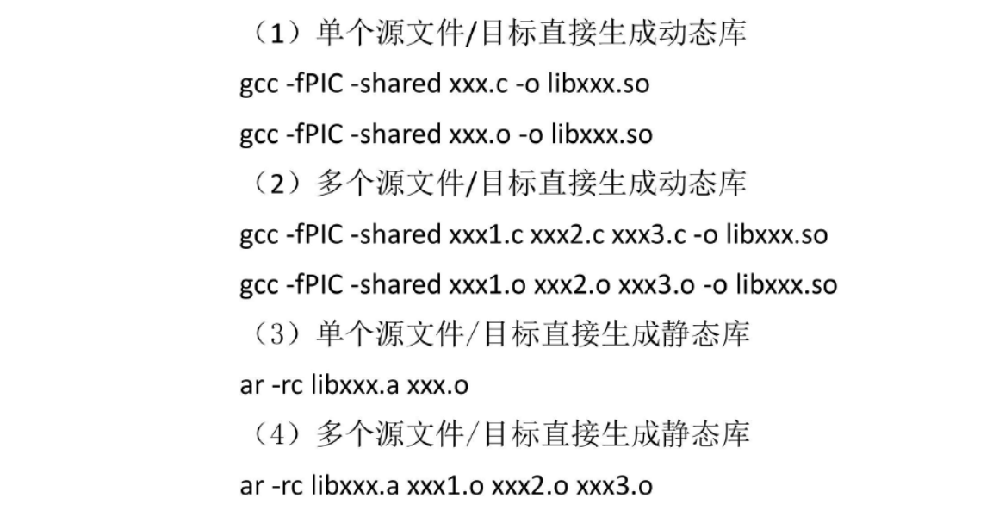

# 一、知识点
## 1、概述

## 2、简介

## 3、编译过程【重要】
- 使用方法：
`gcc [选项] 文件名`

|序号|过程|选项|选项作用|命令|
|:-:|:-:|:-:|:-:|:-:|
|(1)|**`Pre-processsing`**|`-E`|插入头文件，替换宏|`gcc -E test.c -o test.i`|
|(2)|**`Compiling`**|`-S`|编译成汇编|`gcc -S test.i -o test.s`|
|(3)|**`Assembing`**|`-c`|编译成目标文件|`gcc -c test.o -o test.o`|
|(4)|**`Linking`**||链接到库中，变成可执行文件|`gcc test.o -o test`|
以上步骤可一次生成
- `gcc test.c -o test`

## 4、gcc常用选项【重要】

  

## 5、gcc生成动态库和静态库【重要】
  

# 二、练习
